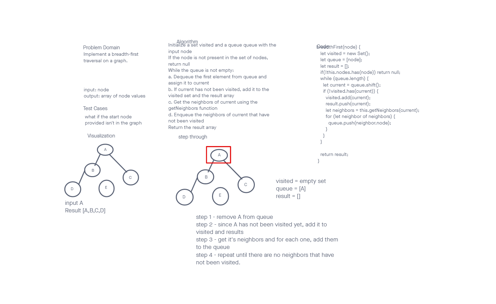
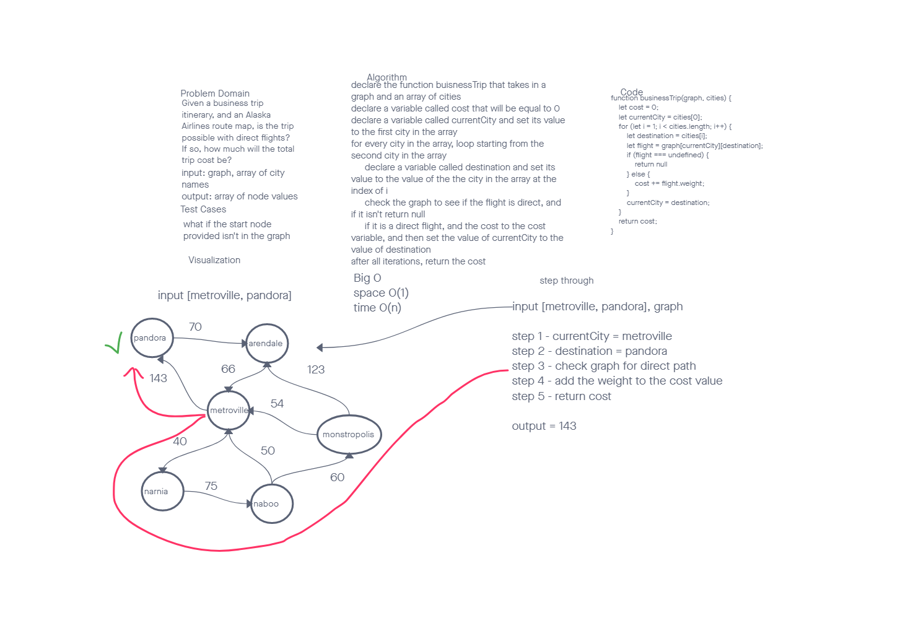

# Graphs

## Challenge

To create a Graph class in javascript represented as an adjacency list, and include methods for adding nodes and edges, getting nodes and neighbors, and determining the size of the graph.

Write a function called business trip
Arguments: graph, array of city names
Return: the cost of the trip (if it’s possible) or null (if not)

## Approach & Efficiency

I approached the challenge by implementing a Graph class that uses a javascript Map to store the nodes and their corresponding edges, and an array to store the weights. The time and space complexity for this approach are O(1) for adding and retrieving nodes, O(n) for adding and retrieving edges, O(1) for size of graph.

The "businessTrip" function uses a simple iterative approach to determine the cost of a trip between multiple cities. It starts by initializing a variable to store the total cost of the trip and setting the current city to the first city in the input array. It then iterates through the cities array, checking for the direct flight from the current city to the destination city and updating the total cost accordingly. If there is no direct flight from the current city to the destination city, the function returns null.

The time complexity of the function is O(n), where n is the number of cities in the input array. This is because the function iterates through the array once and performs a constant-time lookup in the graph for each city. The space complexity of the function is O(1) as it only uses a fixed amount of variables, regardless of the number of cities in the input.

## API

- `addNode(value)` : add a node to the graph and return its value
- `addEdge(node1, node2, weight)` : add an edge between two nodes, including an optional weight, and return nothing
- `getNodes()` : return all of the nodes in the graph
- `getNeighbors(node)` : return a collection of edges connected to the given node, including the weight of the connection
- `size()` : return the total number of nodes in the graph
- `breadthFirst()`: returns the nodes in the order they were visted.
- `buisnessTrip()`: returns the cost of the trip if it is direct or returns null if the nodes are not neighbors

### Whiteboards

#### breadthFirst

