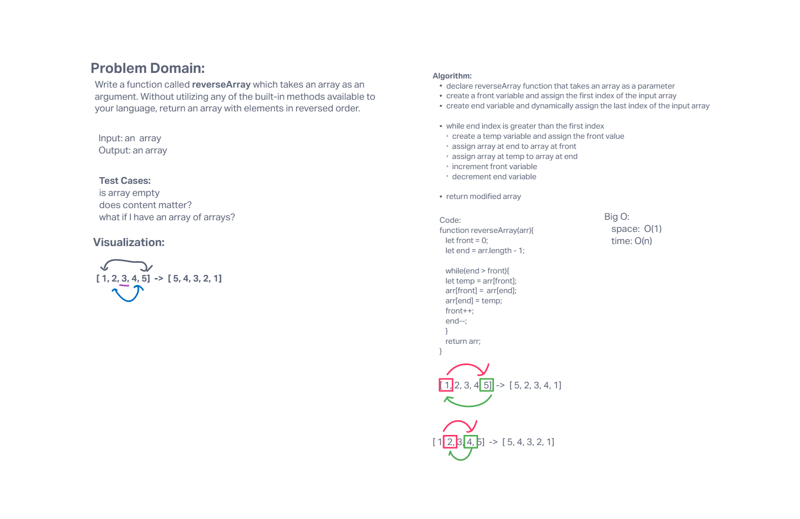

# Reverse an Array
Write a function called reverseArray which takes an array as an argument. Without utilizing any of the built-in methods available to your language, return an array with elements in reversed order.

## Whiteboard Process

## Approach & Efficiency
<!-- What approach did you take? Discuss Why. What is the Big O space/time for this approach? -->
I followed along as this first coding challenge was presented to us, we ended up using a while loop with a front and end variable declared to move through the array and change the values as needed. The Big O space is O(1) and the Big O time is O(n).
