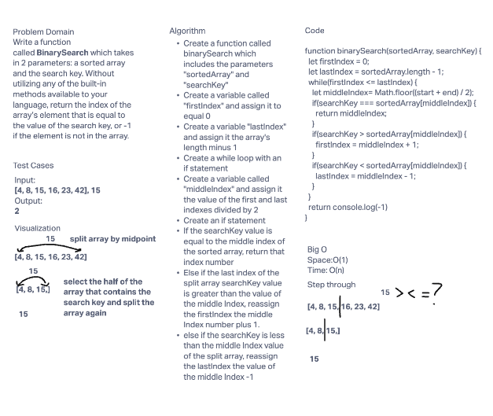

# Reverse an Array
Write a function called reverseArray which takes an array as an argument. Without utilizing any of the built-in methods available to your language, return an array with elements in reversed order.

## Whiteboard Process

## Approach & Efficiency
<!-- What approach did you take? Discuss Why. What is the Big O space/time for this approach? -->
I followed along as this first coding challenge was presented to us, we ended up using a while loop with a front and end variable declared to move through the array and change the values as needed. The Big O space is O(1) and the Big O time is O(n).

# Insert to Middle of an Array
<!-- Description of the challenge -->
Write a function called insertShiftArray which takes in an array and a value to be added. Without utilizing any of the built-in methods available to your language, return an array with the new value added at the middle index.

## Whiteboard Process
<!-- Embedded whiteboard image -->

## Approach & Efficiency
<!-- What approach did you take? Discuss Why. What is the Big O space/time for this approach? -->

We found the middle of the array and assigned it to a variable, we then used a for loop to go over the intial arrays length + 1.
We assigned the index of the new array to the index of the old one, until i matched the value of our middle variable, at that point we assigned the new array at the index of the middle variable to the value in the parameters. After that we assigned the rest of the indexes of the new array to the initial arrays indexes - 1. The Big O space is O(1) and the Big O time is O(n).

# Binary Search of Sorted Array
<!-- Description of the challenge -->
Write a function called BinarySearch which takes in 2 parameters: a sorted array and the search key. Without utilizing any of the built-in methods available to your language, return the index of the array’s element that is equal to the value of the search key, or -1 if the element is not in the array.

## Whiteboard Process
<!-- Embedded whiteboard image -->

## Approach & Efficiency
<!-- What approach did you take? Discuss Why. What is the Big O space/time for this approach? -->
We did a while loop that changes that start or end index of where we're searching based on if the value we were trying to find was greater than or less than the current middle index. If it was either higher or lower, we changed the start or end index and then find the middle again. It continues this process until the index is found, and if it isn't we return -1.
