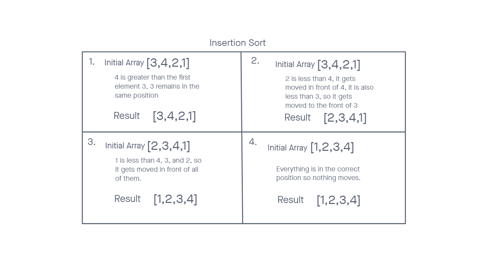

# Insertion Sort

Initial state: 3 4 2 1

1. The first pass will consider the second element (index 1), 4. 4 is greater than the first element (index 0), 3, so it remains in its current position. The array is now `[3, 4, 2, 1]`.

2. The second pass will consider the third element (index 2), 2. 2 is less than 3, so it will be inserted in front of 3. The array is now `[2, 3, 4, 1]`.

3. The third pass will consider the fourth element (index 3), 1. 1 is less than 2, so it will be inserted in front of 2. The array is now `[1, 2, 3, 4]`.

4. The fourth and final pass will consider the first element (index 0), 1. 1 is already in its correct position, so thecd final sorted array is `[1, 2, 3, 4]`.

