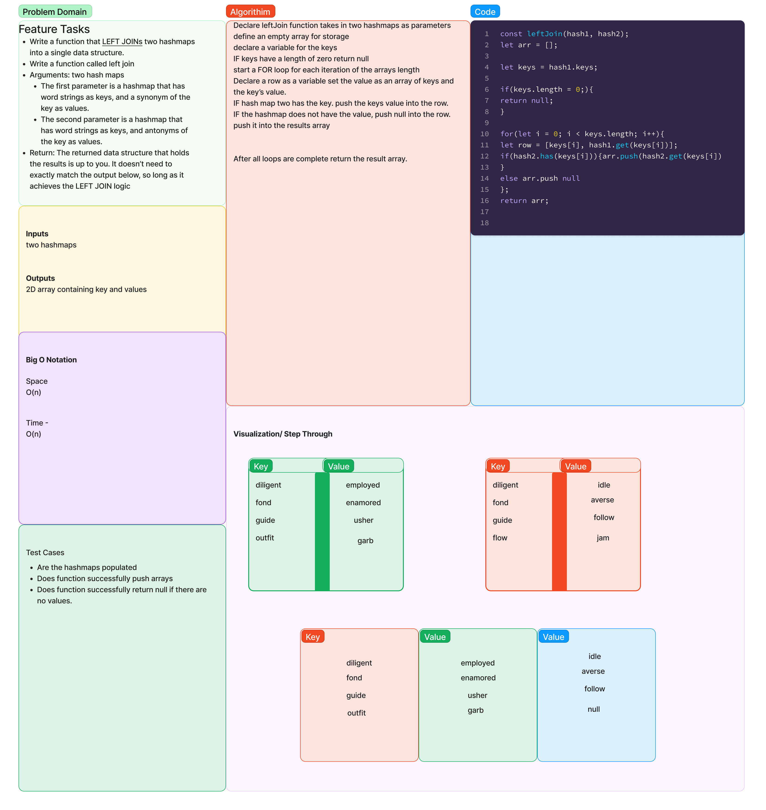

# Hashmap LEFT JOIN
<!-- Short summary or background information -->
leftJoin is a function that takes two hashmaps as input and returns a 2D array, which is a left join of the two input hashmaps. A left join returns all the rows from the left table (first input hashmap) and any matching rows from the right table (second input hashmap). If a key from the left table does not have a match in the right table, then the corresponding value in the output for that key is null.

## Challenge
<!-- Description of the challenge -->
Write a function called left join
Arguments: two hash maps
The first parameter is a hashmap that has word strings as keys, and a synonym of the key as values.
The second parameter is a hashmap that has word strings as keys, and antonyms of the key as values.
Return: The returned data structure that holds the results is up to you. It doesn’t need to exactly match the output below, so long as it achieves the LEFT JOIN logic

## Approach & Efficiency
<!-- What approach did you take? Why? What is the Big O space/time for this approach? -->

The approach I took for the leftJoin function is to iterate through all the keys of the first hashmap, and for each key, I check if that key exists in the second hashmap.
For each key, I add the key, the value from the first hashmap, and the value from the second hashmap if it exists, to a new 2D array.
At the end, I return this 2D array which contains the left join of the two input hashmaps.

BigO - Time - O(n) - Space - O(n)

## Solution
<!-- Embedded whiteboard image -->

