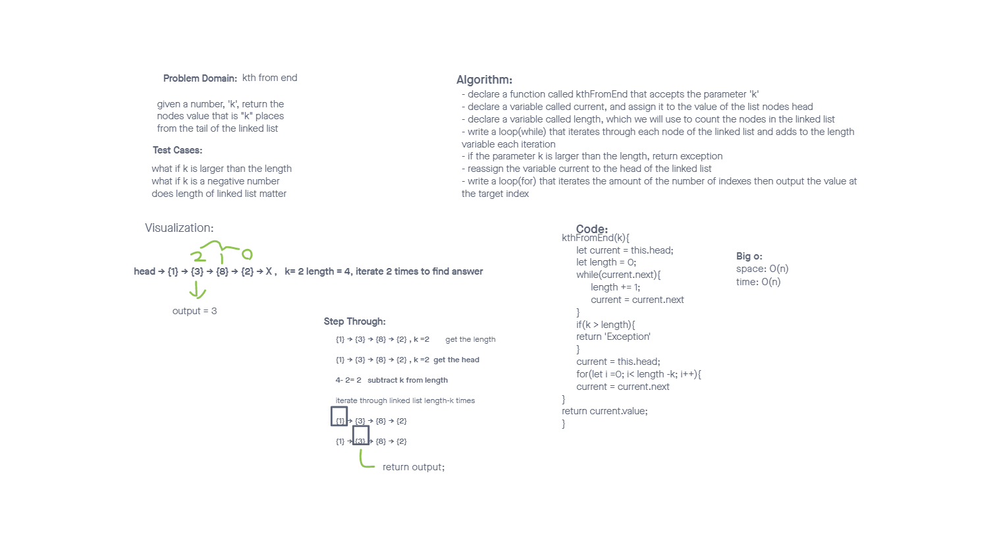

# Singly Linked List
<!-- Short summary or background information -->
inkedList is the dynamic data structure, as we can add or remove elements at ease, and it can even grow as needed. from [Geeksforgeeks](https://www.geeksforgeeks.org/implementation-linkedlist-javascript/)

## Challenge
<!-- Description of the challenge -->
Create a node class and linked list class. The Linked List class should contain the methods insert, includes, and to string.

## Approach & Efficiency
<!-- What approach did you take? Why? What is the Big O space/time for this approach? -->
I simply made the classes for both and made the linked list class include the methods insert, includes, and toString. I made the tests for each of the methods before I created them.

## API
<!-- Description of each method publicly available to your Linked List -->
- inserts
  - Arguments: value
  - Returns: nothing
  - Adds a new node with that value to the head of the list with an O(1) Time performance.

- includes -
  - Arguments: value
  - Returns: Boolean
    - Indicates whether that value exists as a Node’s value somewhere within the list.

- to string
  - Arguments: none
  - Returns: a string representing all the values in the Linked List, formatted as:
"{ a } -> { b } -> { c } -> NULL"

- insertsAfter -
  - Arguments: value, newValue
  - adds a new node with the new value after the node with the value of the parameter value.

- insertsBefore -
  - Arguments: value, newValue
  - adds a new node with the new value before the node with the value of the parameter value.

- kthFromEnd -
  - arguments: k
  - returns the value of the node kth from the end of the linked list.

kthFromEnd whiteboard

