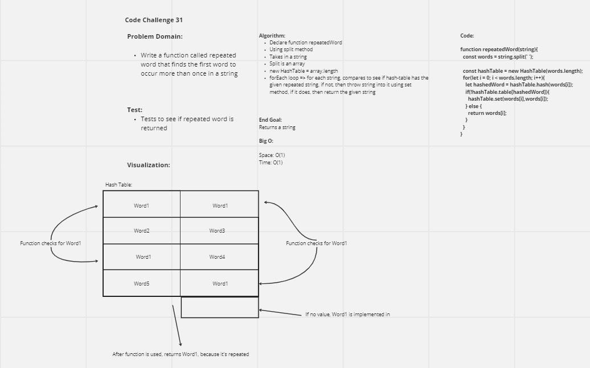

# RepeatedWord
<!-- Short summary or background information -->
Using a hashTable write a function that checks for the first repeated word in a string.

## Challenge
<!-- Description of the challenge -->
Write a function called repeated word that finds the first word to occur more than once in a string
Arguments: string
Return: string

## Approach & Efficiency
<!-- What approach did you take? Why? What is the Big O space/time for this approach? -->
When two keys hash to the same place in the hashmap, the word will be returned, if no repeats return null.
The BigO for time for repeatedWords is O(1).
The BigO for space is O(n).

## API
<!-- Description of each method publicly available in each of your hashtable -->

- repeatedWord
  - arguments - string
  - returns string or null if there aren't any repeated words.

