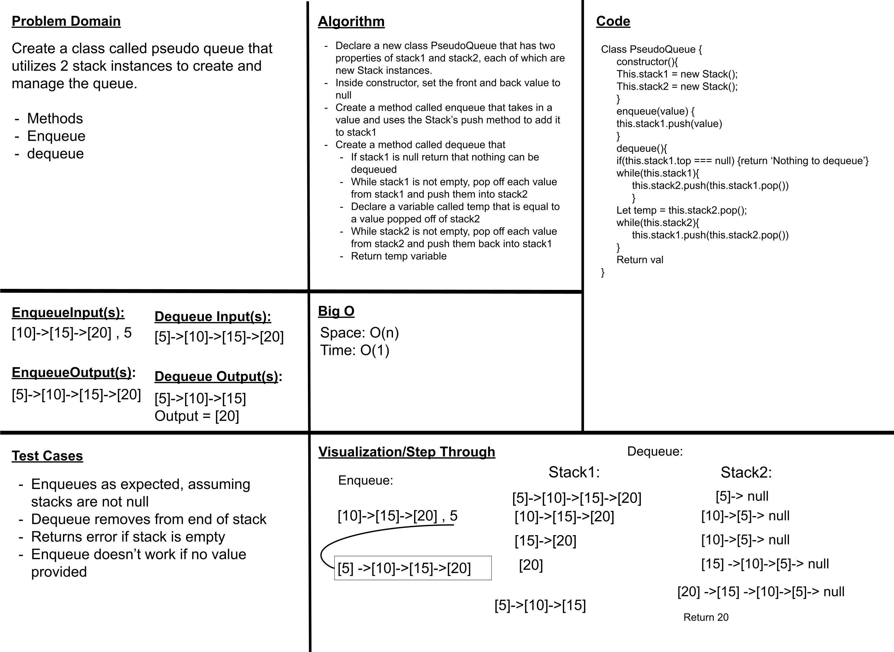
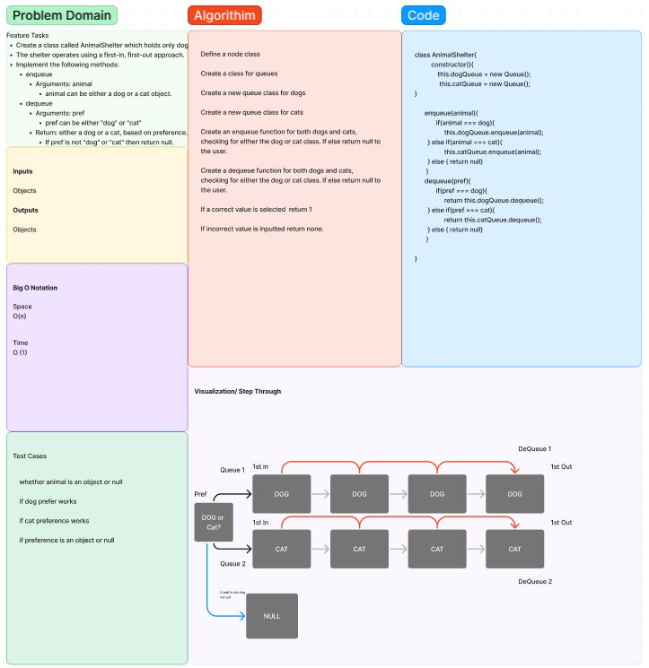

# Stacks and Queues
<!-- Short summary or background information -->
A stack is a data structure that holds a list of elements. A stack works based on the LIFO principle i.e., Last In, First out, meaning that the most recently added element is the first one to remove.[JavaScripttutorial.net](https://www.javascripttutorial.net/javascript-stack/)

A queue is an ordered list of elements where an element is inserted at the end of the queue and is removed from the front of the queue.
A queue works based on the first-in, first-out (FIFO) principle, which is different from a stack, which works based on the last-in, first-out (LIFO) principle. from [JavaScripttutorial.net](https://www.javascripttutorial.net/javascript-queue/)

The pseudoQueue class is essientially a queue but using two stacks to simulate the queues functionality.

## Challenge
<!-- Description of the challenge -->
Using a Linked List as the underlying data storage mechanism, implement both a Stack and a Queue

Create a new class called pseudo queue.
Do not use an existing Queue.
Instead, this PseudoQueue class will implement our standard queue interface (the two methods listed below),
Internally, utilize 2 Stack instances to create and manage the queue.

## Approach & Efficiency
<!-- What approach did you take? Why? What is the Big O space/time for this approach? -->
Created the class and methods for both Stack and Queue, all methods have a time BigO of O(1).
Created the PseudoQueue class, and the methods enqueue and dequeue.

## API
<!-- Description of each method publicly available to your Stack and Queue-->

### Stack -

- push
  - Arguments: value
  - adds a new node with that value to the top of the stack with an O(1) Time performance.
- pop
  - Arguments: none
  - Returns: the value from node from the top of the stack
  - Removes the node from the top of the stack
  - Should raise exception when called on empty stack
- peek
  - Arguments: none
  - Returns: Value of the node located at the top of the stack
  - Should raise exception when called on empty stack
- isEmpty
  - Arguments: none
  - Returns: Boolean indicating whether or not the stack is empty.

### Queue -

- enqueue
  - Arguments: value
  - adds a new node with that value to the back of the queue with an O(1) Time performance.
- dequeue
  - Arguments: none
  - Returns: the value from node from the front of the queue
  - Removes the node from the front of the queue
  - Should raise exception when called on empty queue
- peek
  - Arguments: none
  - Returns: Value of the node located at the front of the queue
  - Should raise exception when called on empty stack
- isEmpty
  - Arguments: none
  - Returns: Boolean indicating whether or not the queue is empty

### PseudoQueue -

- enqueue
  - Arguments: value
  - adds a new node with that value to the front of stack1 with an O(1) Time performance.
- dequeue
  - Arguments: none
  - Returns: the value from node from the front of the stack2
  - pushes all of stack1 into stack2 in reverse order, then removes the last node in stack2, and sends the rest back to stack1
  - Should raise exception when called on empty queue

PseudoQueue whiteboard

### Animal Shelter

- enqueue
  - Arguments: animal
  - adds a new node with that value to the back of the either the dog or cat queue depending on the species with an O(1) Time performance.
- dequeue
  - Arguments: pref
  - Returns: the value from node from the front of the queue
  - Removes the node from the front of either the dog or cat queue depending on the pref argument
  - Should return null if pref is neither a cat or a dog
