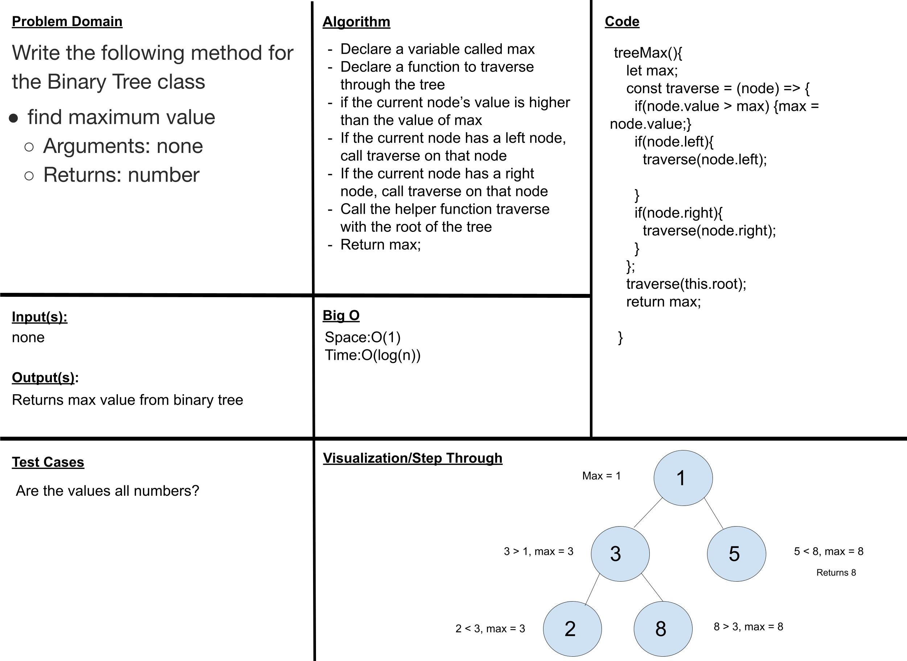

# Trees
<!-- Short summary or background information -->
Implementing the BinaryTree and BinarySearchTree classes.

## Challenge
<!-- Description of the challenge -->

### Binary Tree

- Create a Binary Tree class
- Define a method for each of the depth first traversals:
  - pre order
  - in order
  - post order
Each depth first traversal method should return an array of values, ordered appropriately.

### Binary Search Tree

- Create a Binary Search Tree class
  - This class should be a sub-class (or your languages equivalent) of the Binary Tree Class, with the following additional methods:
    - Add
      - Arguments: value
      - Return: nothing
      - Adds a new node with that value in the correct location in the binary search tree.
    - Contains
      - Argument: value
      - Returns: boolean indicating whether or not the value is in the tree at least once.

## Approach & Efficiency
<!-- What approach did you take? Why? What is the Big O space/time for this approach? -->

I used recursion in each of my methods, I believe the Big O for space for each is O(n) and time is O(log(n))

## API
<!-- Description of each method publicly available in each of your trees -->

- BinaryTree -
  - preOrder - starts from root, goes left, and then right, adds values into array, returns array
  - inOrder - returns array of each value in tree from least to greatest
  - postOrder - goes left first, then right , and then root value of tree
  - treeMax - finds the largest value in a tree
- BinarySearchTree -
  - add - adds value to tree in correct position
  - contains - displays whether or not the value inputted is inside the tree returns true or false

### TreeMax

