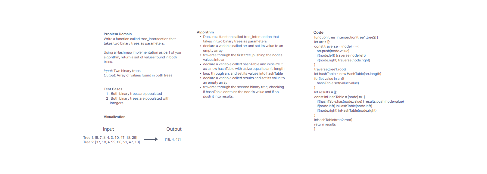

# tree_intersection
<!-- Short summary or background information -->
Tree intersection is a function that returns the matching values in an array

## Challenge
<!-- Description of the challenge -->
Write a function called tree_intersection that takes two binary trees as parameters.
Using your Hashmap implementation as a part of your algorithm, return a set of values found in both trees.

## Approach & Efficiency
<!-- What approach did you take? Why? What is the Big O space/time for this approach? -->
Hashes the first tree into a hashmap, and then traverses through the second tree and checks if the hashmap contains the value, it gets pushed into an array.
Big O - space - O(n) time - O(log(n))

## API
<!-- Description of each method publicly available in each of your hashtable -->

- tree_intersection
  - arguments - two binary trees
  - returns array of shared values

