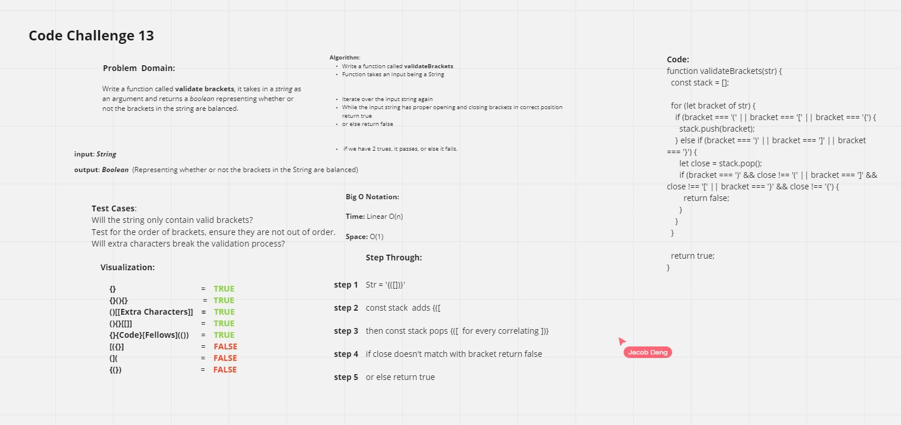

# Validate Brackets
<!-- Short summary or background information -->

## Challenge
<!-- Description of the challenge -->
Write a function called validate brackets
Arguments: string
Return: boolean
representing whether or not the brackets in the string are balanced
There are 3 types of brackets:

Round Brackets : ()
Square Brackets : []
Curly Brackets : {}

## Approach & Efficiency
<!-- What approach did you take? Why? What is the Big O space/time for this approach? -->
I took the approach of adding each opening bracket to the stack, and for each closing set the variable close to pop off one from the stack,
if the bracket and close aren't the corresponding brackets for eachother, return false.

validateBrackets takes in a string, and then sees if the brackets are balanced on each side and returns true or false.

- `{}` = TRUE
- `{}(){}` = TRUE
- `()[[Extra Characters]]` = TRUE
- `(){}[[]]` = TRUE
- `{}{Code}[Fellows](())` = TRUE
- `[({}]` = FALSE
- `(](` = FALSE
- `{(})` = FALSE
